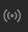
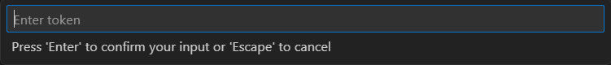

# VkMusicPlugin

**Плагин** для **VS Code**, который выводит название песни, которая на данный момент играет у вас в **VK Music**

## Использование

1. Включите трансляцию музыки в ваш статус  


2. Получите [токен](https://dev.vk.com/ru/api/access-token/getting-started#Ключ%20доступа%20пользователя)

3. При первом запуске, введите токен в окно ввода


4. При необходимости окно ввода токена можно вызвать повторно, вызвав Command Palette (Ctrl+Shift+P) и введя команду Set Token

5. Готово! Теперь та музыка, которую вы в данный момент слушаете в VK Music отображается в статус баре

## Функционал

* activate - функция, вызывающаяся при запуске VS Code.  Она создаёт StatusBarItem, получает token из secrets, запускает цикл получения названия трека (если токен найден в secrets) или вызывает окно ввода токена (иначе), а также добавляет команду Set Token для самостоятельного вызова окна ввода токена

    ```
    activate(context: vscode.ExtensionContext) -> undefined
    ```

* SetToken - функция, получающая токен из окна ввода.
Она создаёт окно ввода токена, получает из него сам токен, запускает цикл получения названия трека и сохраняет токен в secrets
    ```
    SetToken(context: vscode.ExtensionContext) -> undefined
    ```

* StartLoop - функция, запускающая цикл получения трека.
Она очищает существующий объект интервала (защита от запуска нескольких циклов одновременно), устанавливает интервал с функцией, получающей название трека и вызывает функцию SetTrack
    ```
    StartLoop(token: string) -> undefined
    ```

* GetMusic - функция, получающая название трека из VK API. Она делает запрос к VK API и получает статус пользователя. В зависимости от успешности запроса она возвращает либо название трека, либо текст ошибки
    ```
    GetMusic(token: string) -> string
    ```

* SetTrack - функция, устанавливающая название трека в status bar и перезаписывающая current track (защита от многочисленных перезаписей значения в status bar)
    ```
    SetTrack(track: string) -> undefined
    ```

* deactivate - функция, вызывающаяся при завершении работы расширения. Она утилизирует StatusBarItem и очищает объект интервала
    ```
    deactivate() -> undefined
    ```

## История проекта

### Коммит 6b9b085 - Проект готов к сборке

### Коммит e6c0106 - Реализован основной функционал. Добавлена документация